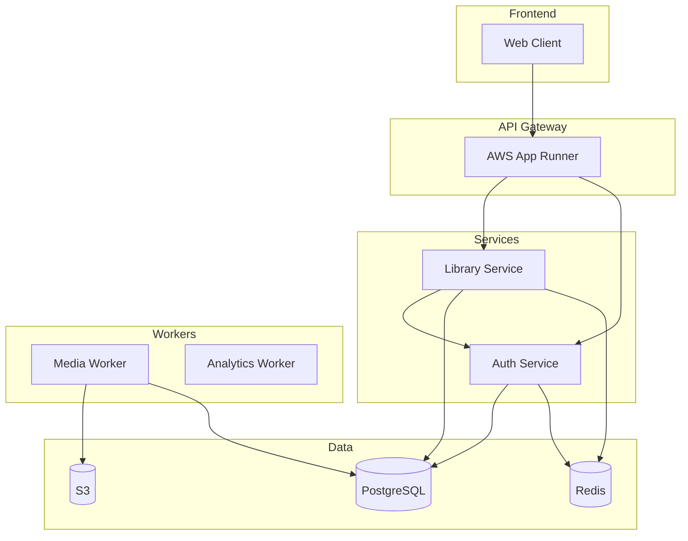

# Library Application Technical Report

> Comprehensive documentation covering the Library Service and Auth Service architecture, endpoints, and workflows.

---

## Table of Contents

1. [System Overview](#system-overview)
2. [Part A: Database Design](#part-a-database-design)
3. [Part B: Library Service Endpoints](#part-b-library-service-endpoints)
4. [Part C: Auth Service Reference](#part-c-auth-service-reference)
5. [Part D: Background Tasks](#part-d-background-tasks)

---

## System Overview

The Library Application is a microservices-based platform consisting of:

| Service | Purpose | Technology |
|---------|---------|------------|
| **Library Service** | Content management (books, authors, reviews, collections) | FastAPI + PostgreSQL |
| **Auth Service** | Authentication, authorization, trust scoring | FastAPI + PostgreSQL |
| **Workers** | Background processing (media, analytics, cleanup) | Celery + Redis |

### Architecture Diagram



---

## Part A: Database Design

### Core Models Overview

| Model | Purpose | Key Features |
|-------|---------|--------------|
| `Author` | Author profiles | Workflow status, wiki-style editing, follower tracking |
| `Book` | Book entries | Full-text search, tags, media files, reviews |
| `Review` | Book reviews | Ratings, helpful votes, trust rewards |
| `Collection` | Curated book lists | Ordered books, workflow, subscriptions |
| `EditHistory` | Audit trail | Version tracking, rollback support |

### Enums

```python
class ContentStatus(str, PyEnum):
    PENDING = "PENDING"    # Awaiting jury approval
    APPROVED = "APPROVED"  # Public content
    REJECTED = "REJECTED"  # Rejected by curator

class VoteType(str, PyEnum):
    HELPFUL = "HELPFUL"
    UNHELPFUL = "UNHELPFUL"

class EditAction(str, PyEnum):
    CREATE = "CREATE"
    UPDATE = "UPDATE"
    DELETE = "DELETE"
    APPROVE = "APPROVE"
    REJECT = "REJECT"
    RECOVER = "RECOVER"
```

### Author Model

| Field | Type | Purpose |
|-------|------|---------|
| `id` | int | Primary key |
| `name` | str(100) | Author name (required) |
| `email` | str(255) | Contact email |
| `bio` | text | Biography |
| `avatar_key` | str(255) | S3 key for avatar |
| `created_by_user_id` | UUID | Creator's user ID |
| `linked_user_id` | UUID | Optional linked user account |
| `status` | ContentStatus | Workflow state |
| `is_public` | bool | Visibility flag |
| `is_deleted` | bool | Soft delete flag |
| `version` | int | Optimistic locking |
| `vote_score` | int | Jury voting score (0-5) |
| `follower_count` | int | Followers count |

**Design Rationale**: Authors support wiki-style editing where any trusted user can improve metadata. The `linked_user_id` connects an author profile to a registered user account.

### Book Model

| Field | Type | Purpose |
|-------|------|---------|
| `id` | int | Primary key |
| `title` | str(500) | Book title |
| `year` | int | Publication year |
| `description` | text | Book description |
| `tags` | ARRAY(str) | Flat tag list for filtering |
| `cover_key` | str(255) | S3 key for cover image |
| `file_key` | str(255) | S3 key for PDF/EPUB |
| `file_format` | str(20) | `pdf` or `epub` |
| `search_tsv` | TSVECTOR | Computed full-text search |
| `average_rating` | float | Aggregated review rating |
| `view_count` | int | Unique views (HyperLogLog) |
| `trending_score` | float | Reddit-style trending algorithm |
| `subscriber_count` | int | Users subscribed to updates |

**Design Rationale**: Books have full-text search using PostgreSQL's `tsvector` with weighted scoring (title=A, description=C). The `trending_score` uses time-decay algorithm for discoverability.

### Review Model

| Field | Type | Purpose |
|-------|------|---------|
| `book_id` | int | FK to Book |
| `user_id` | UUID | Reviewer's user ID |
| `rating` | int | 1-5 rating |
| `comment` | text | Review text |
| `helpful_count` | int | Helpful votes |
| `unhelpful_count` | int | Unhelpful votes |
| `trust_awarded` | int | Trust points given (-5 to +5) |

**Design Rationale**: One review per user per book (unique constraint). Helpful votes contribute to reviewer's trust score.

### Collection Model

| Field | Type | Purpose |
|-------|------|---------|
| `name` | str(200) | Collection name |
| `description` | text | Description |
| `cover_key` | str(255) | Cover image |
| `book_count` | int | Max 100 books |
| `search_tsv` | TSVECTOR | Full-text search |

**Design Rationale**: Collections are ordered lists of books with position tracking via `CollectionBook.position`.

### Social Features

| Model | Relationship | Purpose |
|-------|--------------|---------|
| `AuthorFollow` | User → Author | Following authors |
| `BookSubscription` | User → Book | Book update notifications |
| `CollectionSubscription` | User → Collection | Collection updates |
| `ReviewVote` | User → Review | Helpful/unhelpful voting |
| `JuryVote` | User → Content | Democratic content approval |

### Edit History (Audit Trail)

```python
class EditHistory:
    entity_type: str      # 'author', 'book', 'review', 'collection'
    entity_id: int        # ID of modified entity
    action: EditAction    # CREATE, UPDATE, DELETE, etc.
    user_id: UUID         # Who made the change
    version: int          # Entity version number
    old_data: JSONB       # State before change
    new_data: JSONB       # State after change
    changes: JSONB        # Diff summary
```

**Design Rationale**: Full audit trail enables rollback to any previous version. JSONB snapshots preserve historical state even when related entities are deleted.

---

## Part B: Library Service Endpoints

### Books Router (`routers/book.py`)

**Location**: [book.py](file:///root/apps/fastapi-apps/library-app-book-author-review-service/routers/book.py)

#### Public Endpoints

| Method | Endpoint | Purpose | Dependencies |
|--------|----------|---------|--------------|
| GET | `/books` | List approved books with search | Rate limiting, cursor pagination |
| GET | `/books/{id}` | Get book details | Rate limiting, view tracking |
| GET | `/books/{id}/reviews` | Get book reviews | Rate limiting, cache |

**List Books Workflow**:
1. Apply base filter: `status=APPROVED, is_public=True, is_deleted=False`
2. If `q` parameter: Full-text search with trigram fallback
3. Scoring: 60% FTS + 25% title similarity + 15% author similarity
4. Cursor-based pagination for consistent results
5. Track view via Redis HyperLogLog

#### Authenticated Endpoints

| Method | Endpoint | Scope Required | Purpose |
|--------|----------|----------------|---------|
| GET | `/books/me` | (authenticated) | User's own books |
| POST | `/books` | `books:draft` | Create book submission |
| PUT | `/books/{id}` | `books:update_own` or `books:edit_public_meta` | Full replace |
| PATCH | `/books/{id}` | Same as PUT | Partial update |
| DELETE | `/books/{id}` | `books:delete_own` | Soft delete |
| POST | `/books/{id}/rollback` | `books:update_own` | Version rollback |

#### Review Endpoints

| Method | Endpoint | Scope Required | Purpose |
|--------|----------|----------------|---------|
| POST | `/books/{id}/reviews` | `reviews:create` | Create review |
| PATCH | `/books/{id}/reviews/{rid}` | (owner only) | Update review |
| DELETE | `/books/{id}/reviews/{rid}` | (owner only) | Delete review |
| POST | `/books/{id}/reviews/{rid}/vote` | (authenticated) | Vote helpful/unhelpful |

#### Curator Endpoints

| Method | Endpoint | Scope Required | Purpose |
|--------|----------|----------------|---------|
| POST | `/books/{id}/approve` | `jury:override` | Instant approval (+10 trust) |
| POST | `/books/{id}/reject` | `jury:override` | Rejection (-5 trust) |

---

### Authors Router (`routers/author.py`)

**Location**: [author.py](file:///root/apps/fastapi-apps/library-app-book-author-review-service/routers/author.py)

#### Public Endpoints

| Method | Endpoint | Purpose | Features |
|--------|----------|---------|----------|
| GET | `/authors` | List authors | Trigram similarity search |
| GET | `/authors/{id}` | Get author details | Cache support |
| GET | `/authors/{id}/books` | Get author's books | Only approved books |

#### Authenticated Endpoints

| Method | Endpoint | Scope Required | Purpose |
|--------|----------|----------------|---------|
| GET | `/authors/me` | (authenticated) | User's created authors |
| POST | `/authors` | `authors:draft` | Create author profile |
| PUT | `/authors/{id}` | `authors:update_own` or `authors:update_public_meta` | Full replace |
| PATCH | `/authors/{id}` | Same as PUT | Partial update |
| DELETE | `/authors/{id}` | `authors:delete_own` | Soft delete |
| POST | `/authors/{id}/rollback` | `authors:update_own` | Version rollback |

#### Social Endpoints

| Method | Endpoint | Purpose |
|--------|----------|---------|
| POST | `/authors/{id}/follow` | Follow author |
| DELETE | `/authors/{id}/follow` | Unfollow author |

---

### Jury Router (`routers/jury.py`)

**Location**: [jury.py](file:///root/apps/fastapi-apps/library-app-book-author-review-service/routers/jury.py)

The jury system enables democratic content approval.

#### Queue Viewing (requires `jury:view`)

| Method | Endpoint | Purpose |
|--------|----------|---------|
| GET | `/jury/authors` | List pending authors |
| GET | `/jury/authors/{id}` | Pending author details |
| GET | `/jury/books` | List pending books |
| GET | `/jury/books/{id}` | Pending book details |
| GET | `/jury/collections` | List pending collections |
| GET | `/jury/collections/{id}` | Pending collection details |

#### Voting

| Method | Endpoint | Scope | Vote Weight |
|--------|----------|-------|-------------|
| POST | `/jury/authors/{id}/vote` | `jury:vote` | +1 (contributor) |
| POST | `/jury/authors/{id}/vote` | `jury:vote_weighted` | +5 (trusted) |
| DELETE | `/jury/authors/{id}/vote` | (authenticated) | Retract vote |

**Auto-Approval Workflow**:
1. User casts vote (weight based on role)
2. `vote_score` is incremented
3. When `vote_score >= 5`: Auto-publish content
4. Award +10 trust to content submitter
5. Clear all jury votes for this content

---

### History Router (`routers/history.py`)

**Location**: [history.py](file:///root/apps/fastapi-apps/library-app-book-author-review-service/routers/history.py)

#### Endpoints

| Method | Endpoint | Purpose | Access |
|--------|----------|---------|--------|
| GET | `/books/{id}/history` | Book edit history | Public/owner/jury |
| GET | `/authors/{id}/history` | Author edit history | Public/owner/jury |
| GET | `/collections/{id}/history` | Collection edit history | Public/owner/jury |
| GET | `/history/{id}` | Full history record detail | Same as parent |

**Access Control**:
- Public entities: Anyone can view history
- Private entities: Owner or `jury:view` scope required

---

### Collections Router (`routers/collection.py`)

**Location**: [collection.py](file:///root/apps/fastapi-apps/library-app-book-author-review-service/routers/collection.py)

#### Public Endpoints

| Method | Endpoint | Purpose |
|--------|----------|---------|
| GET | `/collections` | List collections with search |
| GET | `/collections/{id}` | Collection with ordered books |

#### CRUD Endpoints

| Method | Endpoint | Scope Required | Purpose |
|--------|----------|----------------|---------|
| GET | `/collections/me` | (authenticated) | User's collections |
| POST | `/collections` | `collections:create` | Create collection |
| PATCH | `/collections/{id}` | `collections:update_own` | Update metadata |
| DELETE | `/collections/{id}` | `collections:delete_own` | Soft delete |

#### Book Management

| Method | Endpoint | Purpose |
|--------|----------|---------|
| POST | `/collections/{id}/books` | Add book at position |
| PATCH | `/collections/{id}/books/{bid}` | Reorder book |
| DELETE | `/collections/{id}/books/{bid}` | Remove book |

---

### Upload Router (`routers/upload.py`)

**Location**: [upload.py](file:///root/apps/fastapi-apps/library-app-book-author-review-service/routers/upload.py)

**Pattern**: Presign → Client Upload → Commit → Celery Process

#### Book Cover Upload

| Method | Endpoint | Purpose |
|--------|----------|---------|
| POST | `/uploads/books/{id}/cover/presign` | Get presigned S3 URL |
| POST | `/uploads/books/{id}/cover/commit` | Confirm upload, trigger processing |

#### Book File Upload (PDF/EPUB)

| Method | Endpoint | Purpose |
|--------|----------|---------|
| POST | `/uploads/books/{id}/file/presign` | Get presigned URL for book file |
| POST | `/uploads/books/{id}/file/commit` | Confirm, trigger validation |

#### Author Avatar Upload

| Method | Endpoint | Purpose |
|--------|----------|---------|
| POST | `/uploads/authors/{id}/avatar/presign` | Presigned URL for avatar |
| POST | `/uploads/authors/{id}/avatar/commit` | Confirm avatar upload |

#### Collection Cover Upload

| Method | Endpoint | Purpose |
|--------|----------|---------|
| POST | `/uploads/collections/{id}/cover/presign` | Presigned URL |
| POST | `/uploads/collections/{id}/cover/commit` | Confirm upload |

**Presign Workflow**:
1. Validate user has permission to upload
2. Generate temporary S3 key: `temp/{entity_type}/{entity_id}/{uuid}.{ext}`
3. Create presigned POST with conditions (content-type, size limits)
4. Return presigned URL and form fields

**Commit Workflow**:
1. Verify entity version hasn't changed
2. Dispatch Celery task for processing
3. Return success (processing is async)

---

## Part C: Auth Service Reference

### Main Application (`main.py`)

**Location**: [main.py](file:///root/apps/fastapi-apps/library-app-book-author-review-service/DevNotes/AuthUserServiceCopyForReference_deleteoncewired/app/main.py)

#### Health Endpoints

| Method | Endpoint | Purpose |
|--------|----------|---------|
| GET | `/health` | Liveness probe (always 200) |
| GET | `/ready` | Readiness probe (checks DB + Redis) |
| GET | `/test` | Serve test frontend |

---

### RBAC System (`rbac.py`)

**Location**: [rbac.py](file:///root/apps/fastapi-apps/library-app-book-author-review-service/DevNotes/AuthUserServiceCopyForReference_deleteoncewired/app/rbac.py)

#### Role Hierarchy

| Role | Trust Threshold | Reputation | Description |
|------|-----------------|------------|-------------|
| `unverified` | - | - | Email not verified |
| `blacklisted` | - | - | Read-only access |
| `user` | 0 | - | Default role, can draft content |
| `contributor` | ≥10 | - | Jury voter (+1 weight) |
| `trusted` | ≥50 | ≥80% | Direct publish, +5 vote weight |
| `curator` | ≥80 | ≥90% | Instant approve/reject |
| `admin` | - | - | Full system access |

#### Key Scopes by Level

**Level 1 - Consumer**:
- `books:read`: Read published books
- `reviews:create`: Post reviews

**Level 2 - Drafting (user)**:
- `books:draft`, `books:update_own`, `books:delete_own`
- `authors:draft`, `authors:update_own`, `authors:delete_own`
- `collections:create`, `collections:update_own`, `collections:delete_own`

**Level 3 - Jury (contributor)**:
- `jury:view`: Access review queue
- `jury:vote`: Cast +1 vote
- `reports:create`: Flag content

**Level 4 - Trusted**:
- `books:edit_public_meta`, `authors:edit_public_meta`: Wiki editing
- `books:publish_direct`, `authors:publish_direct`: Bypass queue
- `jury:vote_weighted`: +5 vote weight

**Level 5 - Curator**:
- `jury:override`: Instant approve/reject
- `users:ban`: Ban users
- `content:takedown`: DMCA removal

---

### Auth Router (`routers/auth.py`)

**Location**: [auth.py](file:///root/apps/fastapi-apps/library-app-book-author-review-service/DevNotes/AuthUserServiceCopyForReference_deleteoncewired/app/routers/auth.py)

#### Authentication Endpoints

| Method | Endpoint | Purpose |
|--------|----------|---------|
| POST | `/auth/register` | Create new user |
| POST | `/auth/login` | Login, get tokens |
| POST | `/auth/refresh` | Refresh access token |
| POST | `/auth/logout` | Revoke refresh token |
| GET | `/auth/sessions` | List active sessions |

#### Email Verification

| Method | Endpoint | Purpose |
|--------|----------|---------|
| POST | `/auth/verify-email/send` | Send verification email |
| GET | `/auth/verify-email` | Verify email token |

#### Avatar Management

| Method | Endpoint | Purpose |
|--------|----------|---------|
| POST | `/auth/avatar/presign` | Get presigned upload URL |
| POST | `/auth/avatar/commit` | Confirm avatar upload |

**Login Workflow**:
1. Validate email/username + password
2. Check user is active and not blacklisted
3. Calculate roles from trust_score + reputation
4. Generate access token (15min) with roles/scopes
5. Generate refresh token (7 days), store in DB
6. Set refresh token as HttpOnly cookie

---

### User Router (`routers/user.py`)

**Location**: [user.py](file:///root/apps/fastapi-apps/library-app-book-author-review-service/DevNotes/AuthUserServiceCopyForReference_deleteoncewired/app/routers/user.py)

#### User Profile

| Method | Endpoint | Purpose |
|--------|----------|---------|
| GET | `/user/me` | Current user info |
| GET | `/user/{id}` | Public user profile |
| PATCH | `/user/me` | Update profile |
| POST | `/user/me/email` | Change email |

#### Trust Management (Service-to-Service)

| Method | Endpoint | Purpose | Auth |
|--------|----------|---------|------|
| POST | `/user/{id}/trust` | Adjust trust score | Service token |
| GET | `/user/{id}/trust` | Get trust info | User or admin |
| GET | `/user/{id}/trust/history` | Trust change history | Admin only |
| POST | `/user/{id}/submissions` | Adjust submission counts | Service token |

#### User Existence Check

| Method | Endpoint | Purpose |
|--------|----------|---------|
| GET | `/user/exists` | Check if user exists (for Library Service) |

---

### Reports Router (`routers/reports.py`)

**Location**: [reports.py](file:///root/apps/fastapi-apps/library-app-book-author-review-service/DevNotes/AuthUserServiceCopyForReference_deleteoncewired/app/routers/reports.py)

#### Content Reporting

| Method | Endpoint | Role Required | Purpose |
|--------|----------|---------------|---------|
| POST | `/reports` | contributor+ | Submit content report |
| GET | `/reports` | admin | List all reports |
| POST | `/reports/{id}/review` | admin | Approve/reject report |
| POST | `/reports/users/{id}/unlock` | admin | Unlock locked user |

**Auto-Lock Workflow**:
1. User submits report on edit_history entry
2. System counts distinct trusted reporters
3. When count ≥ 10: Auto-lock the reported user
4. Admin can manually unlock after review

---

## Part D: Background Tasks

### Celery Configuration (`celery_app.py`)

**Location**: [celery_app.py](file:///root/apps/fastapi-apps/library-app-book-author-review-service/celery_app.py)

#### Task Queues

| Queue | Tasks | Purpose |
|-------|-------|---------|
| `media` | `tasks.media.*` | Image/file processing |
| `analytics` | `tasks.analytics.*` | Statistics calculation |
| `default` | `tasks.cleanup.*` | Maintenance tasks |

#### Beat Schedule

| Task | Schedule | Purpose |
|------|----------|---------|
| `cleanup_soft_deleted_content` | Daily 2AM | Hard delete after 24h |
| `cleanup_expired_uploads` | Hourly | Remove temp uploads |
| `sync_view_counts` | Hourly :15 | Redis → PostgreSQL sync |
| `recalculate_average_ratings` | Hourly :10 | Aggregate review ratings |
| `calculate_trending_scores` | Every 6h | Reddit-style trending |

---

### Media Tasks (`tasks/media.py`)

**Location**: [media.py](file:///root/apps/fastapi-apps/library-app-book-author-review-service/tasks/media.py)

#### `process_avatar`

**Purpose**: Process avatar images (square sizes)

**Workflow**:
1. Download original from S3 temp location
2. Validate image format (JPEG, PNG, WebP, AVIF)
3. Optional ClamAV virus scan
4. Resize to 512, 256, 128 pixels (square)
5. Convert to WebP format
6. Upload all variants to final S3 location
7. Update entity's `avatar_key` with edit history
8. Delete temp file

**Output Sizes**: 512×512, 256×256, 128×128 (WebP)

#### `process_cover`

**Purpose**: Process cover images (2:3 portrait ratio)

**Workflow**: Similar to avatar, but:
- Sizes: 1800×2700, 1200×1800, 600×900
- Maintains 2:3 aspect ratio

#### `process_book_file`

**Purpose**: Validate and process PDF/EPUB files

**Workflow**:
1. Download from temp S3 location
2. Validate PDF magic bytes or EPUB structure
3. Optional ClamAV virus scan
4. Move to final S3 location: `books/{book_id}/files/{uuid}.{format}`
5. Update `Book.file_key` and `Book.file_format`
6. Record in edit history

---

### Analytics Tasks (`tasks/analytics.py`)

**Location**: [analytics.py](file:///root/apps/fastapi-apps/library-app-book-author-review-service/tasks/analytics.py)

#### `sync_view_counts`

**Purpose**: Sync Redis HyperLogLog view counts to PostgreSQL

**Workflow**:
1. Scan Redis for `book:views:*` keys
2. Get PFCOUNT for each (unique viewers)
3. Update `Book.view_count` in database
4. Runs hourly

#### `calculate_trending_scores`

**Purpose**: Reddit-style trending algorithm

**Formula**:
```
score = log10(max(views, 1)) / ((age_hours + 2) ^ gravity)
```

- `gravity = 1.5`: Controls time decay rate
- Logarithmic scaling prevents mega-hits from dominating
- Runs every 6 hours

#### `recalculate_average_ratings`

**Purpose**: Aggregate review ratings

**Workflow**:
1. Group reviews by `book_id`
2. Calculate average rating
3. Update `Book.average_rating`

---

### Cleanup Tasks (`tasks/cleanup.py`)

**Location**: [cleanup.py](file:///root/apps/fastapi-apps/library-app-book-author-review-service/tasks/cleanup.py)

#### `cleanup_soft_deleted_content`

**Purpose**: Hard delete soft-deleted content after 24h grace period

**Workflow**:
1. Find all entities where `is_deleted=True` and `deleted_at < now - 24h`
2. Hard delete authors, books, collections
3. Returns counts of deleted entities

---

## Appendix: Key Dependencies

### Auth Client (`services/auth_client.py`)

Used by Library Service to communicate with Auth Service:

- `adjust_trust_for_approval(user_id)`: +10 trust for approved content
- `adjust_trust_for_rejection(user_id)`: -5 trust for rejected content
- `adjust_trust_for_review(user_id, delta)`: ±1-5 for helpful/unhelpful votes
- `validate_user_exists(user_id)`: Check user exists
- `readiness_check()`: Health check
- `health_check()`: Simple health check

### Rate Limiting

All endpoints use token bucket rate limiting via Redis:

| Category | Capacity | Refill Rate |
|----------|----------|-------------|
| READ | 100 | 10/min |
| WRITE | 20 | 5/min |
| SENSITIVE | 10 | 2/min |

### Caching

- Book details: 5 minutes TTL
- Author details: 5 minutes TTL
- Reviews list: 5 minutes TTL
- User info: 15 minutes TTL
- Invalidated on: create, update, delete, approve, reject

---

*Generated: 2025-12-27*
